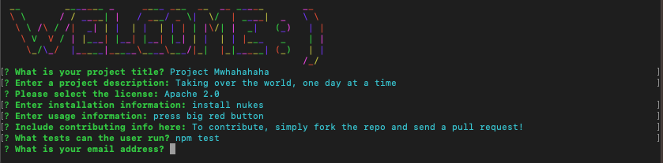

# README.md Generator 

[](https://opensource.org/licenses/MIT)

## Description 

This is a programme that dynamically creates a README.md file based on the responses given by the user. Via the command line, the user is given prompts to answer; answers that are used within the generated markdown. 

NOTE: this is not a dynamically generated README.md file. To view an example of the program output, please view the generated-README.md file that is stored in the repo. 

### Technologies Used:
- Javascript
- Node.js
- Inquirer, colors and figlet npm packages
- The command line (CLI)

### What I learnt: 
- How to install and use external npm packages within my own programme
- Using node.js allows us to use JavaScript without the need of a browser 
- Why package.json files are created (helps users install dependencies in npm)
- How to create a command line application that dynamically generates a README file based on the user's input 
- The importance of referring to the docs when stuck

## Installation 
Git clone the repo onto your local machine. To install the necessary dependencies for this programme, please run the following command in the command line: 
```
npm install
```
## Usage
To run this program, write the following command in the terminal: 
```
node index.js
```
As the file path is relative, please make sure you are in the right directory when you type the command. After pressing enter, the user will be welcomed automatically by the program and then will be given a series of prompts to answer. 



Once the prompts have been answered, a readme.md file will be dynamically generated with all the information gathered via the npm package 'inquirer'. For a proper demonstration, please watch this [video](blahblah) to gain a better understanding of how to use this application. 

## License 

Please refer to the LICENSE in the repo.

## Contributing 

If you would like to contribute, you are very welcome to! For this repo, the "fork-and-pull" Git workflow will be used. 

Steps: 
- Fork the repo on GitHub
- Clone the project to your own machine
- Create a feature branch (git checkout -b BRANCH_NAME) and commit changes to your own branch
- Push your work back up to your fork 
- Submit a Pull request so that we can review your changes

Be sure to merge the latest from "upstream" before making a pull request!


## Tests 

To run tests, please run the following command: 
```
npm test
```

---

## Questions

If you have any questions about the repo, open an issue or contact me directly at cameron-edek-poole@gmail.com. 
You can find more of my work by clicking on my GitHub username: [cedekpoole](https://github.com/cedekpoole/).
Feel free to also add me on [LinkedIn](https://www.linkedin.com/in/cam-edek-poole/). :)